# GISTC - Sistema de Gestão de Inventário e Licenças

## 1. Título e descrição do projeto

**Nome do sistema:** GISTC

**Breve descrição do propósito:** Sistema de gestão desenvolvido para controlar inventário, notas fiscais e licenças de uma empresa de transporte. A aplicação utiliza Flutter com Firebase como backend e implementa controle de acesso segmentado por unidade federal com auditoria completa de operações.

**Problema solucionado:** Centraliza o controle de ativos (inventário) e licenças regulatórias, eliminando a gestão manual e descentralizada. Facilita o acesso rápido à informação para administradores e operadores, com rastreamento completo de alterações e alertas automáticos de vencimento de licenças.

---

## 2. Funcionalidades implementadas

**Lista de funcionalidades principais:**

- **Autenticação e Autorização**: Login com Firebase Auth, primeiro login obrigatório com troca de senha, controle de permissões por níveis (Usuário Básico, Operador, Administrador)
- **Gestão por UF**: Segmentação de dados por Unidade Federativa, operadores restritos à sua UF, administradores com acesso cross-UF
- **Módulo de Inventário**: Cadastro completo de itens (produto, descrição, valor, número de série, garantia, tipo, localização), dashboard analítico em tempo real, busca e filtros avançados, exportação para Excel
- **Módulo de Licenças**: Licenças predefinidas por UF (CE e SP), controle automático de status (válida, próximo vencimento, vencida), upload e gerenciamento de arquivos (PDF, imagens)
- **Sistema de Auditoria**: Registro completo de todas as ações (create, update, delete, view, export, login, logout), logs imutáveis com retenção de 1 ano, interface de consulta com filtros avançados
- **Notificações por Email**: Alertas automáticos para licenças próximas do vencimento ou vencidas via EmailJS
- **Soft Delete e Lixeira**: Exclusão reversível de registros com possibilidade de restauração (apenas administradores)

**Status de implementação:** Completo (100% dos requisitos funcionais atendidos)

**Screenshots das telas principais:**

### Autenticação
- Login  
  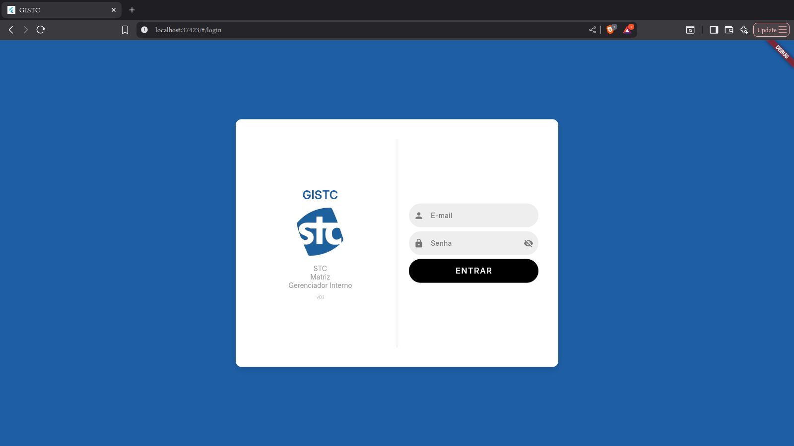
- Primeiro Login - Alteração de Senha  
  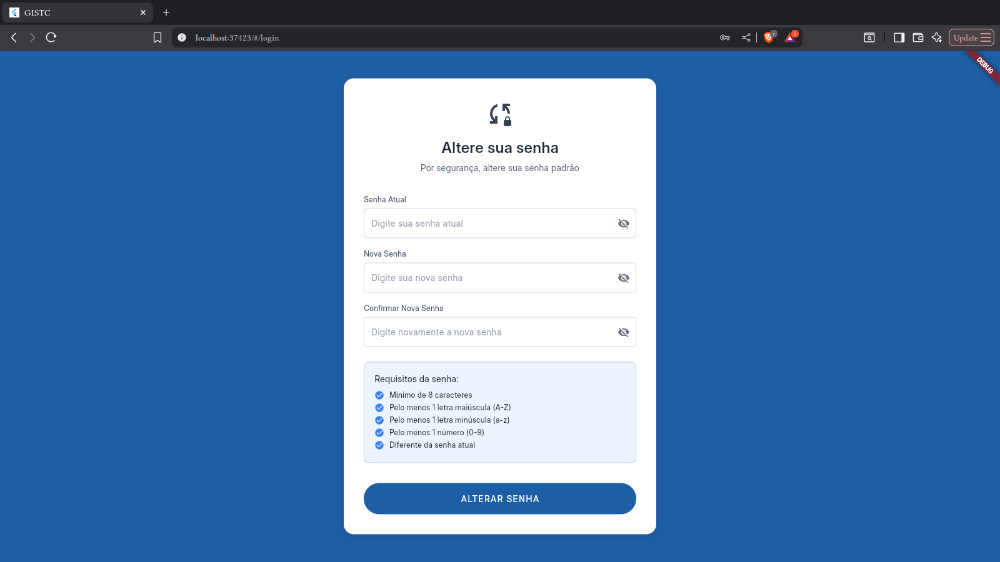
- Home  
  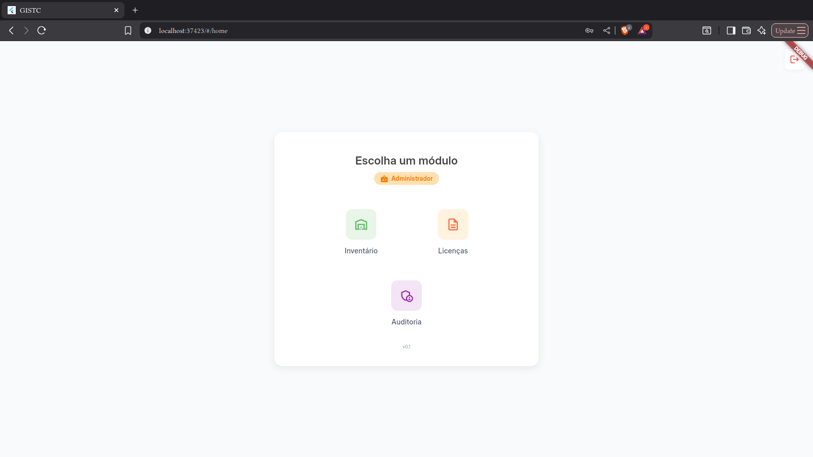

### Módulo de Licenças
- Gestão de Licenças  
  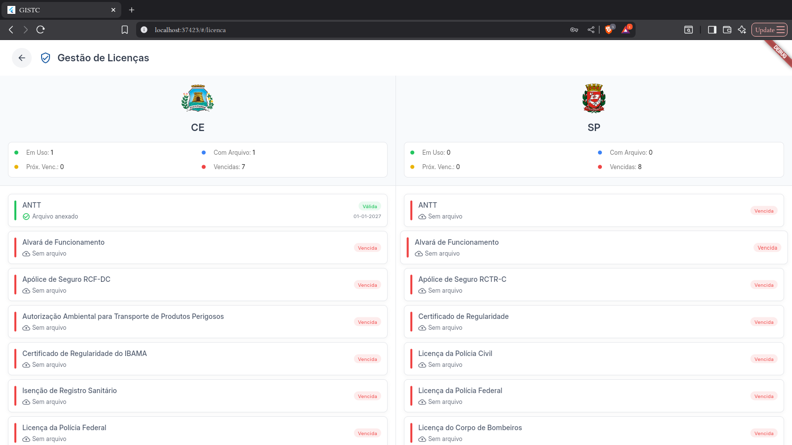

### Módulo de Auditoria
- Logs de Auditoria  
  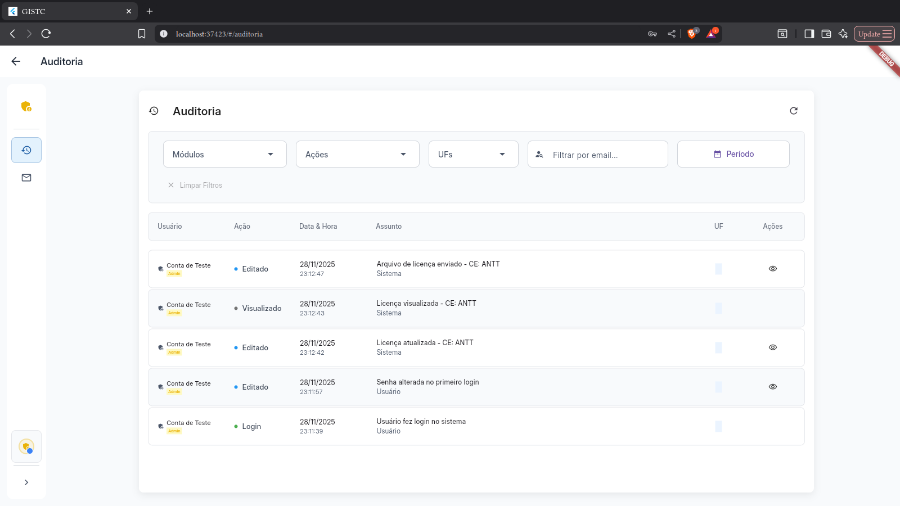
- Configuração de Emails  
  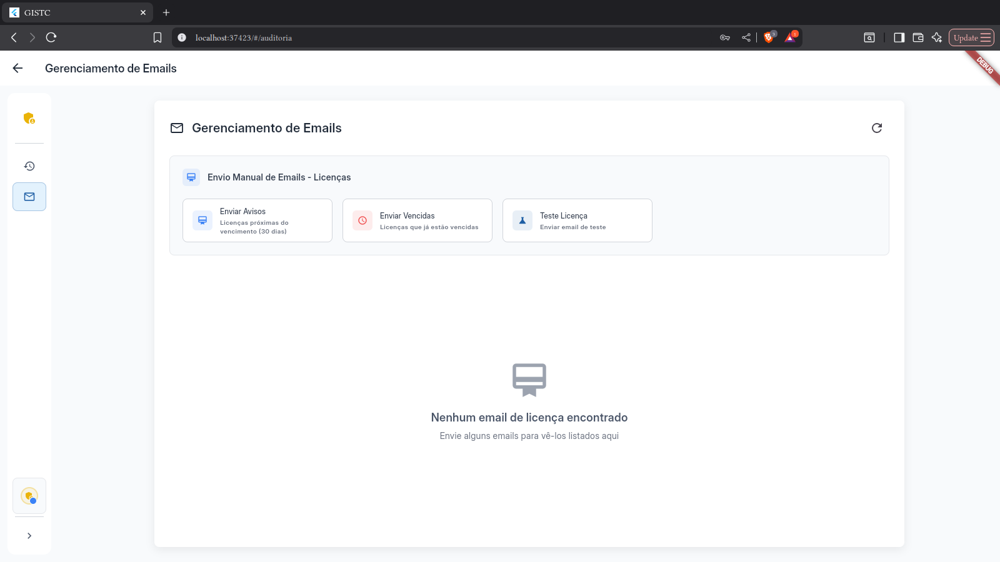

### Módulo de Inventário
- Dashboard  
  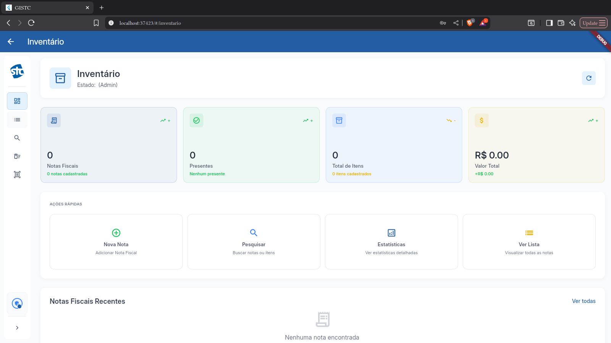
- Lista de Inventário  
  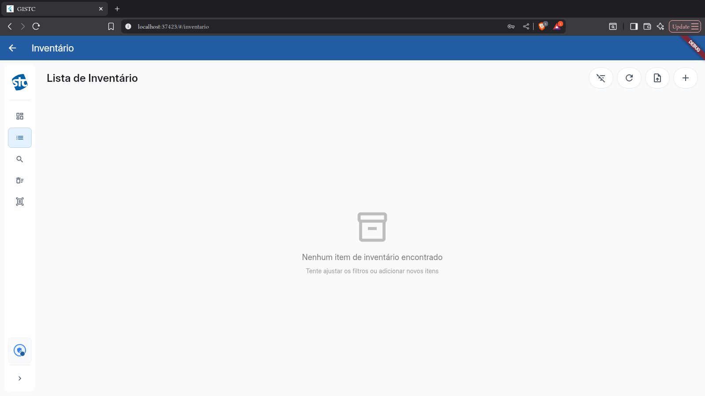
- Busca Avançada  
  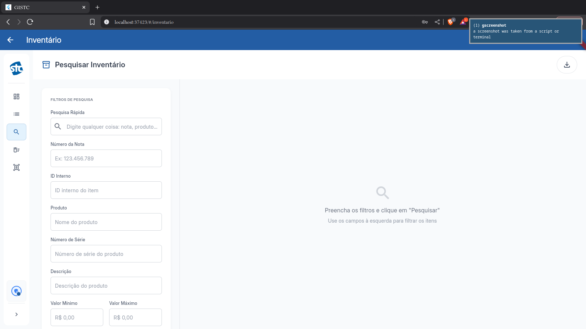
- Formulário de Cadastro  
  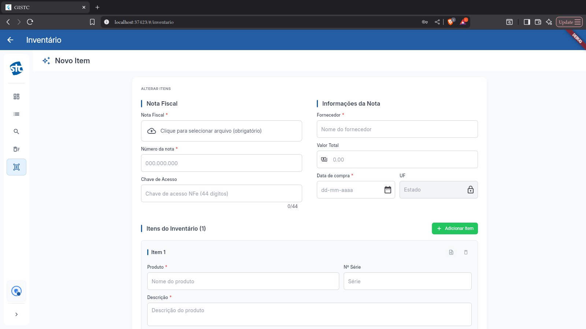
- Itens Excluídos (Lixeira)  
  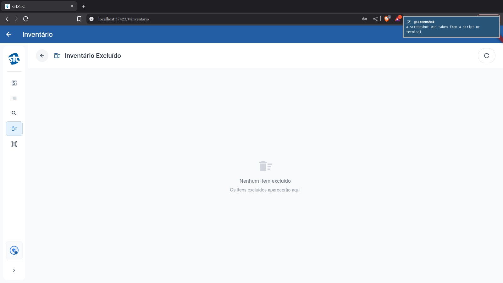

---

## 3. Tecnologias utilizadas

**Linguagens de programação:**
- Dart (aplicação Flutter)
- JavaScript (Cloud Functions)

**Frameworks e bibliotecas:**
- Flutter 3.x (framework de interface)
- Material Design (design system)

**Banco de dados:**
- Cloud Firestore (NoSQL)
- Firebase Storage (arquivos)

**Ferramentas de desenvolvimento:**
- VS Code
- Git/GitHub
- Firebase Console

---

## 4. Arquitetura do sistema

**Visão geral da arquitetura implementada:**

O sistema segue uma arquitetura em camadas:

- **Camada de Apresentação** (`modules/`): Interfaces de usuário, páginas, diálogos e formulários
- **Camada de Lógica de Negócio** (`services/`): AuditLogService, UserRoleService, FirstLoginService, LicenseEmailService, ActivityTracker
- **Camada de Acesso a Dados** (`helpers/`): Operações CRUD com Firestore, padrão Singleton
- **Camada de Modelos** (`models/`): Estruturas de dados (Inventario, License, UserRole, AuditLog, etc.)
- **Camada de Utilitários** (`core/`): AuthWrapper, ActivityWrapper, DesignSystem, exportação Excel

**Componentes principais:**
- **Firebase Authentication**: Gerenciamento de sessões e autenticação
- **Cloud Firestore**: Armazenamento de dados estruturados (inventários, licenças, usuários, logs)
- **Firebase Storage**: Armazenamento de arquivos (PDFs, imagens de licenças e notas fiscais)
- **Cloud Functions**: Limpeza automática de logs de auditoria (retenção de 1 ano)
- **EmailJS**: Envio de notificações de vencimento de licenças

**Integrações realizadas:**
- Firebase Auth para autenticação
- Firestore para persistência de dados
- Firebase Storage para upload/download de arquivos
- EmailJS para notificações por email

---

## 5. Instruções de instalação e execução

**Pré-requisitos:**
- Flutter SDK 3.0 ou superior instalado
- Dart SDK (incluído no Flutter)
- Navegador Chrome (recomendado para execução web)
- Git para clonar o repositório
- Conta Firebase configurada (opcional para desenvolvimento local)

**Passo a passo para instalação:**

   ```bash
   git clone https://github.com/maestroanton/stc-unifor.git
   cd stc-unifor

   flutter create .
   flutter pub get
   flutter doctor
   flutter run -d chrome
```

**Configurações necessárias:**
- As configurações do Firebase já estão incluídas no repositório
- EmailJS requer configuração de serviceId e templateId em `lib/services/license_email.dart` (já configurado no código)

---

## 6. Acesso ao sistema

**URL do sistema:** https://gstc-52174.web.app/ (maior facilidade para teste, use as credenciais abaixo para entrar no sistema).

**Credenciais de teste:**
- e-mail: teste@gistc.com
- senha: 123123

---

## 7. Validação com Público-Alvo

**Definição do público-alvo:**

O sistema foi desenvolvido para dois perfis principais:

1. **Administradores (Diretoria)**: Gestores financeiros e operacionais com necessidade de controle completo sobre ativos, licenças e geração de relatórios. Frequência de uso imprevisível. Exemplo: Wostenes Passos e Savio Moreira.

2. **Operadores (Gestores Operacionais)**: Profissionais de logística responsáveis por registrar e informar dados aos diretores. Uso semanal. Exemplo: Karla.

**Resumo do processo de validação:**

O sistema foi validado através de:
- Análise detalhada dos requisitos com stakeholders
- Implementação baseada em casos de uso reais da empresa de transporte
- Validação de todas as funcionalidades contra os requisitos documentados
- Coleta de feedback estruturado via formulário com usuários-chave (Wóstenes Passos - Diretoria)
- 100% dos requisitos funcionais atendidos (15 de 15 implementados)
- 4 requisitos descartados (OCR e DeepSeek) por análise de custo-benefício

**Principais feedbacks recebidos:**
**Módulo de Licenças:**
- Status: **Perfeitamente satisfatório**
- Feedback: "O módulo de licenças foi implementado com todas as atribuições necessárias"

**Módulo de Inventário:**
- Status: **Satisfatoriamente atendido**
- Sugestões de melhoria:
  - Adicionar CNPJ da empresa no header dos relatórios exportados (não feito)
  - Possibilitar anexar arquivo das notas fiscais diretamente na criação de um item (feito)

**Módulo de Administração:**
- Status: **Satisfatoriamente atendido**
- Sugestões de melhoria:
  - Estender funcionalidade para controle de permissões sem intervenção direta do desenvolvedor (interface de gerenciamento de usuários) (não feito)

**Interface de Usuário (UI):**
- Status: **Perfeitamente satisfatória**
- Feedback: "Rápida e fácil de utilizar"

**Performance e Fluidez:**
- Status: **Perfeitamente satisfatória**
- Feedback: "Nenhum problema de performance"

---

## 8. Equipe de desenvolvimento

**Membros da equipe:**
- **Antônio Gomes Moreira Sobrinho** - Matrícula: 2313605 - Desenvolvedor Full Stack

**Papéis e contribuições principais:**
- Arquitetura do sistema e modelagem de dados
- Implementação completa do frontend Flutter
- Integração com Firebase (Auth, Firestore, Storage, Functions)
- Sistema de auditoria e controle de permissões
- Documentação técnica e de requisitos

---

## Documentação Técnica

Para mais informações, consulte:

* **`/docs/requirements/requirements.md`**: Requisitos funcionais e não-funcionais completos
* **`/docs/api/api_documentation.md`**: APIs, serviços, helpers e modelos
* **`/docs/architecture/architecture.md`**: Arquitetura, padrões de código e fluxo de dados
* **`/docs/validation/target_audience.md`**: Definição do público-alvo
* **`/docs/validation/validation_report.md`**: Relatório completo de validação com evidências
